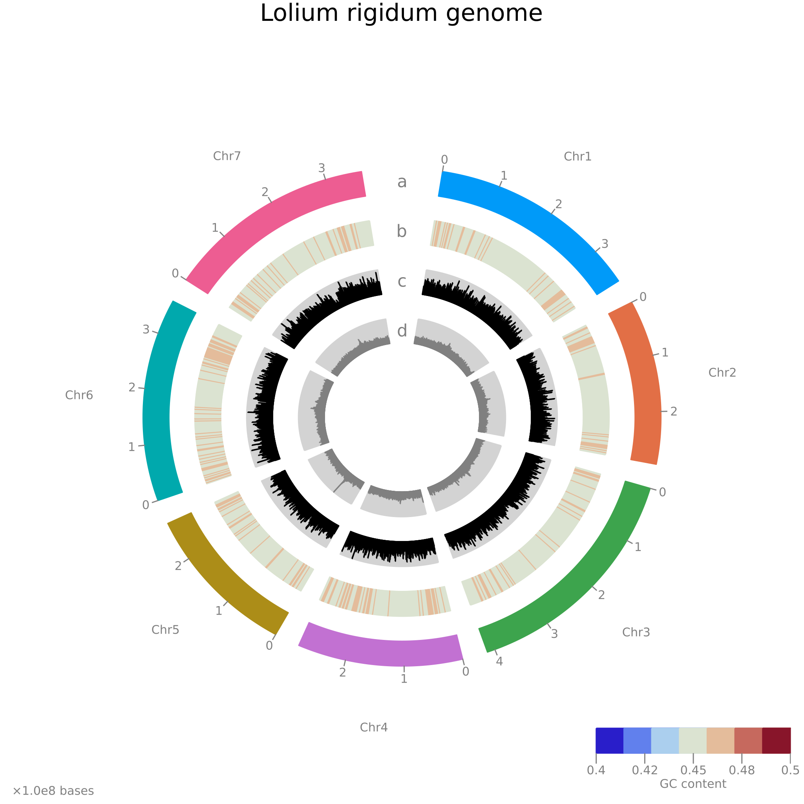

# *Lolium rigidum* genome assembly and annotation
Assembly of the *Lolium rigidum*, L. genome and genome annotations.

|**Lab Website**|**CSIRO Website**|**License**|
|:-------:|:--------:|:--------:|
| <a href="https://adaptive-evolution.biosciences.unimelb.edu.au/"> | <a href="https://www.csiro.au/en/"> | [](https://www.gnu.org/licenses/gpl-3.0) |

Our objective is to generate a better genome assembly and genome annotations than that of the closely-related forage crop species [*Lolium perenne*](https://onlinelibrary.wiley.com/doi/full/10.1111/tpj.13037).

## NCBI WGS Accession identifiers

| SUBID | BioProject | BioSample | Accession | Organism |
|:-----:|:----------:|:---------:|:---------:|:--------:|
| SUB10975047 | PRJNA799061 | SAMN25144995 | JAKKIG000000000 | Lolium rigidum FL_2022 |

This Whole Genome Shotgun project has been deposited at DDBJ/ENA/GenBank under the accession **JAKKIG000000000**. The version described in this paper is version **JAKKIG010000000**. Notice the **01** in JAKKIG**01**0000000 to denote the version - probably?

## Sequencing
- Illumina Hiseq X
- Promethion
- Hi-C

## Assembly
- CSIRO pipeline

## Annotation
- NCBI pipeline

## Assembly characterisation
- Developing a CIRCOS-style visualisation tool in julia

<a href="misc/Lolium_rigidum_genome.png">

- Install julia
   ```{sh}
   ### Install Julia
   wget https://julialang-s3.julialang.org/bin/linux/x64/1.7/julia-1.7.1-linux-x86_64.tar.gz
   tar xvzf julia-1.7.1-linux-x86_64.tar.gz
   echo alias \'julia=$(pwd)/julia-1.7.1/bin/julia\' >> ~/.bashrc
   sourc

## Assembly synteny with other species

## Resistance genes assesment

## Distribution and genetic variation of Lolium in SE Australia