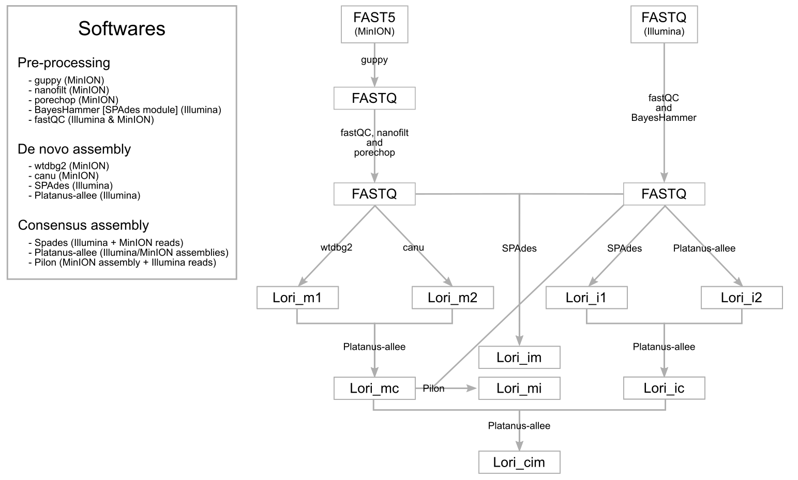
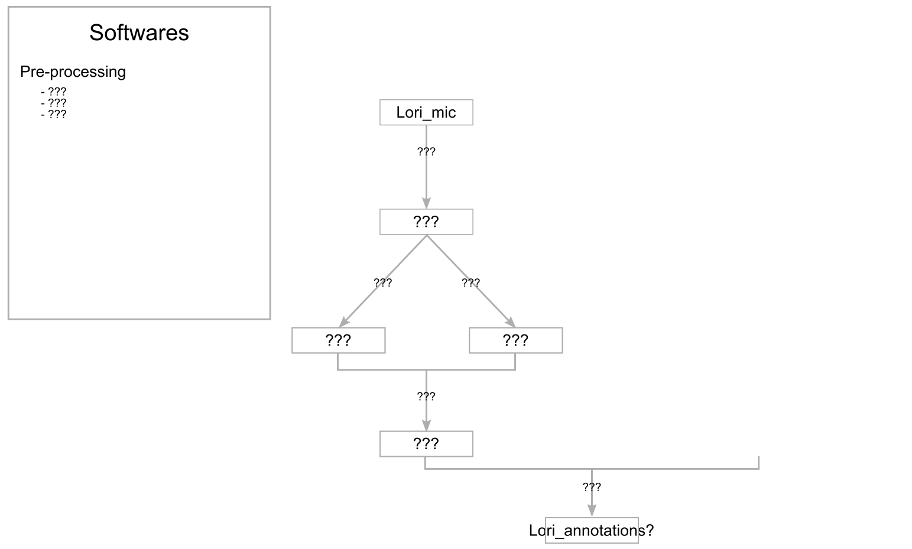

# *Lolium rigidum* genome assembly and annotation
Assembly of the *Lolium rigidum*, L. genome and genome annotations.

|**Lab Website**|**License**|
|:-------:|:--------:|
| <a href="https://adaptive-evolution.biosciences.unimelb.edu.au/"> |  |

Our objective is to generate a better genome assembly and genome annotations than that of the closely-related forage crop species [*Lolium perenne*](https://onlinelibrary.wiley.com/doi/full/10.1111/tpj.13037). The tentative genome assembly workflow is illustrated below:

The genome annotation pipeline has not been drafted yet:

The softwares we are using are linked below:
- [Biopython](https://biopython.org/)
- [Canu](https://canu.readthedocs.io/en/latest/)
- [FastQC](https://www.bioinformatics.babraham.ac.uk/projects/fastqc/)
- [Guppy](https://genomebiology.biomedcentral.com/articles/10.1186/s13059-019-1727-y)
- [Nanofilt](https://github.com/wdecoster/nanofilt)
- [Platanus-allee](http://platanus.bio.titech.ac.jp/platanus2)
- [Porechop](https://github.com/rrwick/Porechop)
- [SPAdes](https://github.com/ablab/spades/blob/spades_3.14.1/README.md)
- [wtdbg2](https://www.nature.com/articles/s41592-019-0669-3)
