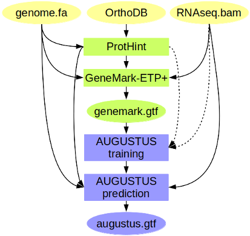

# Gaisu-Augustus/BRAKER pipeline D



## Working directory
```{sh}
DIR=/data/Lolium_rigidum_ASSEMBLY/ANNOTATION
```

## Install dependencies

1. Perl modules
```{sh}
sudo cpan Hash::Merge MCE::Mutex Math::Utils Parallel:ForkManager ### GeneMark-EX dependencies
sudo cpan threads YAML Thread::Queue ### ProtHint dependencies
sudo cpan File::Spec::Functions List::Util Module::Load::Conditional POSIX File::HomeDir ### Braker dependencies
```

2. GeneMark-EX
Download **GeneMark-ES/ET/EP** manually from (http://exon.gatech.edu/GeneMark/license_download.cgi)[http://exon.gatech.edu/GeneMark/license_download.cgi]. Enter the credentials being required. You will need to download the software and its corresponding key.
```{sh}
tar -xvzf gmes_linux_64.tar.gz ### decompress the software
gunzip -d gm_key_64.gz; mv gm_key_64 gmes_linux_64/.gm_key ### decompress, rename, set as hidden, and move to the GeneMark-EX directory
cd gmes_linux_64/
./check_install.bash ### check installation of GeneMark-EX
cd -
export GENEMARK_PATH=${DIR}/gmes_linux_64/
```

3. Augustus
```{sh}
wget https://github.com/Gaius-Augustus/Augustus/releases/download/v3.4.0/augustus-3.4.0.tar.gz
tar -xvzf augustus-3.4.0.tar.gz
sudo apt install libboost-iostreams-dev zlib1g-dev libgsl-dev libboost-all-dev libsuitesparse-dev liblpsolve55-dev \
                 libsqlite3-dev libmysql++-dev \
                 libbamtools-dev libboost-all-dev libboost-all-dev \
                 libhts-dev
cd augustus-3.4.0/
make
bin/augustus --species=help
auxprogs/bam2hints/bam2hints -h
sudo make install
export AUGUSTUS_CONFIG_PATH=${DIR}/augustus-3.4.0/config/
cd -    
```

4. Python 3
```{sh}
sudo apt install python3.8.10
```

5. Samtools and Bamtools
```{sh}
sudo apt install samtools bamtools
```

6. NCBI+
```{sh}
sudo apt install ncbi-blast+
```

7. ProtHint
```{sh}
wget https://github.com/gatech-genemark/ProtHint/releases/download/v2.6.0/ProtHint-2.6.0.tar.gz
tar -xvzf ProtHint-2.6.0.tar.gz
cd ProtHint-2.6.0
bin/prothint.py -h
cd -
```

8. Biopython
```{sh}
sudo pip3 install biopython
```

9. cdbfasta
```{sh}
sudo apt install cdbfasta
```

10. GenomeThreader
```{sh}
wget https://genomethreader.org/distributions/gth-1.7.3-Linux_x86_64-64bit.tar.gz
tar -xvzf gth-1.7.3-Linux_x86_64-64bit.tar.gz
PATH=${PATH}:${DIR}/gth-1.7.3-Linux_x86_64-64bit/bin
```

11. Exonorate
```{sh}
sudo apt install exonerate
```

12. GUSHR
```{sh}
sudo apt install openjdk-8-jdk
git clone https://github.com/Gaius-Augustus/GUSHR.git
```

13. MakHub
```{sh}
wget https://github.com/Gaius-Augustus/MakeHub/archive/refs/tags/1.0.6.tar.gz
```

14. Install Star transcriptome aligner
```{sh}
sudo apt install -y rna-star
```

## Download Viridiplantae protein database
```{sh}
wget https://v100.orthodb.org/download/odb10_plants_fasta.tar.gz
tar -xvzf odb10_plants_fasta.tar.gz
cat plants/Rawdata/* > plant_proteins.fasta
```